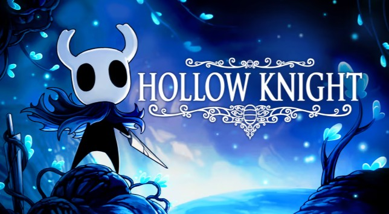

# Firdavs Muqimtoshov

## IGM-110
- https://www.rit.edu/
- [RIT](https://www.rit.edu/)

## II. **Uses**
- Documentation for software projects on GitHub
- Lecture notes for awesome classes (like this one!)
- "Marking up" message text in Discord & Slack
- Documents about anything, for anyone!

## III. Syntax
How do I make:
- emoji :smile:
  - clickable links
- bulleted lists
- nested lists
- text effects such as:
- **bold** text
- *italic* text
- `and code blocks`
- horizontal rules
- links to images
- and display images in a markdown document?
---

## IV. Favorite Game



 ```
 const Pi = 3.1415;
 ```
